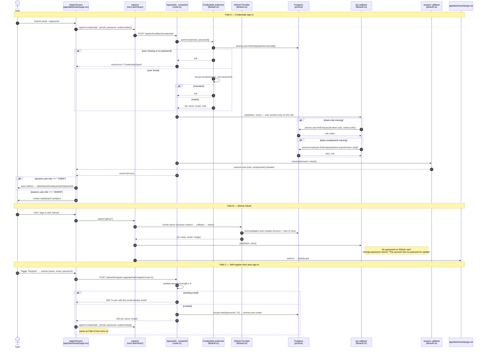
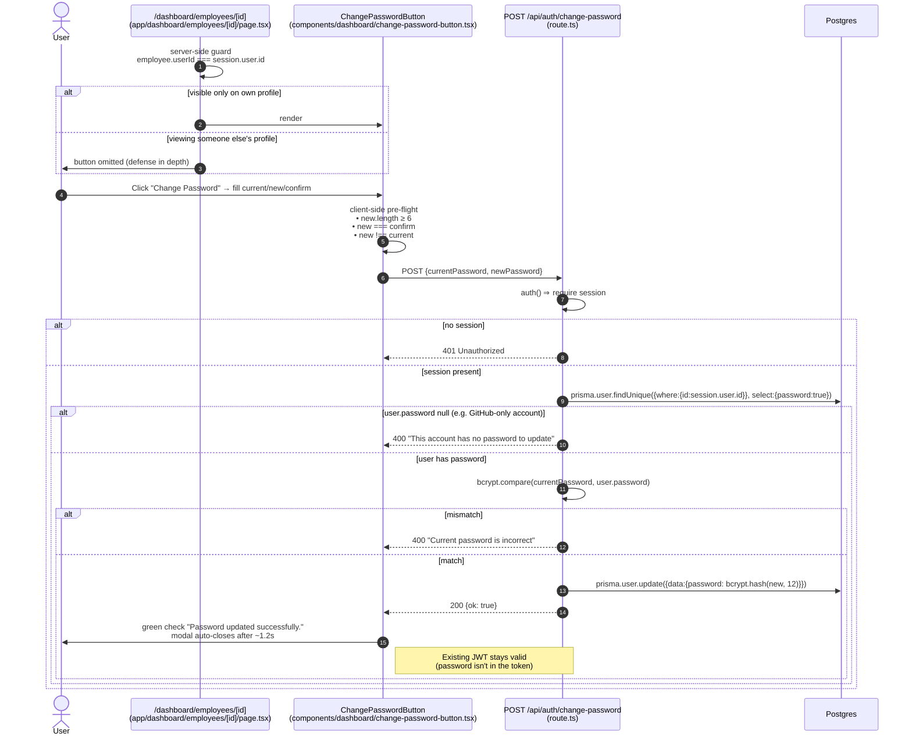

# Auth Flow

Three entry points (**Credentials** sign-in, **GitHub** OAuth, **self-register**) and one privileged mutation (**change own password**). All routes share the same JWT session; an admin/USER first-paint redirect routes people to the right place.

## Diagram 1 — Sign in (Credentials & GitHub) + Self-Register



## Diagram 2 — Change own password



## Diagram 3 — Proxy middleware (`proxy.ts`) protects `/dashboard/employees/*`

```mermaid
flowchart TD
  Req([Incoming request<br/>matcher /dashboard/employees/*]) --> Auth{auth()<br/>⇒ session?}
  Auth -- "no session" --> Bounce[NextResponse.redirect<br/>new URL "/dashboard", request.url)]
  Auth -- "yes" --> Pass[NextResponse.next]
  Bounce --> Dash[/dashboard<br/>renders SignInScreen]
  Pass --> Page[/dashboard/employees/&#123;id&#125;<br/>full profile page]
```

### Why this matters

- **JWT strategy, not database sessions** — `session: { strategy: "jwt" }` keeps `proxy.ts` cheap and lets the change-password route live without auto-invalidation.
- **One-shot legacy fixup in the `jwt` callback** — `role` and `employeeId` are fetched from the DB only when the token already lacks them (`if (!token.role && token.sub)` / `if (token.sub && !token.employeeId)` in `lib/auth.ts`). After that first hydration the JWT locks the values in for its full lifetime (~30 d by default), so **DB role changes do NOT propagate to in-flight sessions** — the user has to re-login (or wait for JWT expiry) to see role upgrades take effect. Same applies to `employeeId` — once it's bound to a User, unlinking + re-linking won't move the user until they sign in fresh. The branch exists as a migration fixup for tokens issued before the hook was added, not as a continuous re-hydration.
- **GitHub-only accounts can't change password** — the API returns *"This account has no password to update"* rather than crashing; this is also why the UI button is the only entry point, and why this endpoint silently no-ops on accounts that have never had a password.
- **Per-field eye toggles** — the modal currently has independent visibility flags for `Current`, `New`, and `Confirm`, so users can reveal only the field they're auditing without exposing the rest.

### File map

| File                                                | Role                                       |
| --------------------------------------------------- | ------------------------------------------ |
| `lib/auth.ts`                                        | NextAuth config + provider + JWT/Sess cbs  |
| `app/api/auth/[...nextauth]/route.ts`                | NextAuth HTTP handler                      |
| `app/api/auth/register/route.ts`                    | Self-register POST endpoint                |
| `app/api/auth/change-password/route.ts`             | Change-own-password POST endpoint          |
| `app/dashboard/page.tsx`                             | `SignInScreen` + role-based first-paint redirect |
| `components/dashboard/change-password-button.tsx`    | Modal form with pre-flight validation      |
| `app/dashboard/employees/[id]/page.tsx`             | Renders the button only on own profile     |
| `proxy.ts`                                           | Redirects unauthenticated requests         |
