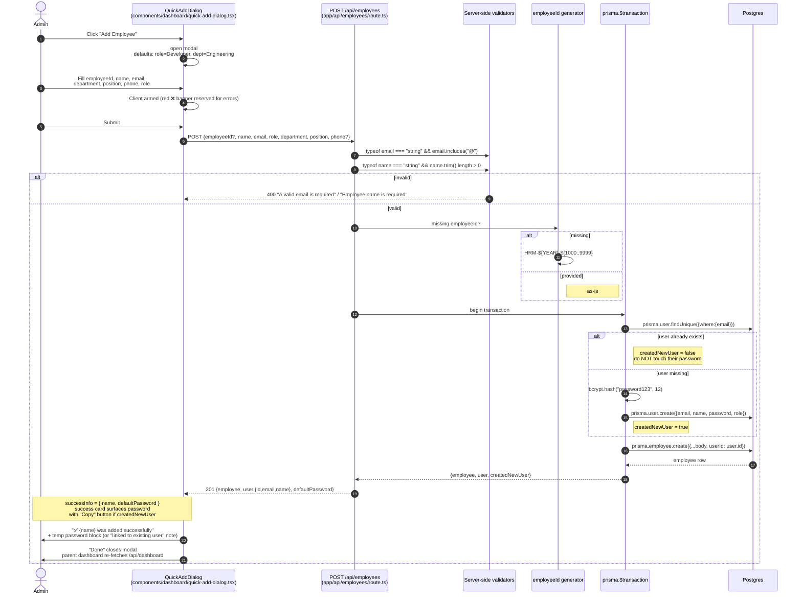

# Employee Onboarding Flow

Two paths for getting an `Employee` row linked to a `User` so the new hire can sign in:

1. **Quick Add** (admin UI) — atomic mint of both records inside `prisma.$transaction`.
2. **Idempotent backfill** (`npm run seed:employee-users`) — for legacy `Employee` rows that pre-date the auto-link logic. Safe to re-run.

## Path 1 — Admin Quick Add



### Why atomic?

A two-step "create user, then create employee" would risk a dangling FK if the second leg failed or the process died between calls. Wrapping both legs in `prisma.$transaction` means the database rolls back the user mint if the employee insert fails — the UI never has to invent compensating logic.

### Why reuse existing users?

If a hire self-registered via the in-app `Register` flow **before** the admin ran Quick Add, they already have a password of their own choosing. Minting a fresh `User` here would either shadow theirs (data loss) or hit a unique constraint on `email`. Re-linking avoids both.

### Quick Add returns both documents (no password leak)

The response shape is `{employee, user:{id, email, name}, defaultPassword}` — only `defaultPassword` reveals the temp credential, and only when `createdNewUser === true`. Self-registered users see the equivalent *"Linked to an existing user"* banner instead.

---

## Path 2 — Idempotent backfill (`scripts/seed-employee-users.ts`)

For every `Employee` where `userId IS NULL`:

```mermaid
flowchart TD
  Start([npm run seed:employee-users]) --> Args{Includes --dry-run?}
  Args -- yes --> DryRun[Set isDryRun = true]
  Args -- no --> Apply[Set isDryRun = false]
  DryRun --> Read[prisma.employee.findMany<br/>where: &#123; userId: null &#125;<br/>orderBy: createdAt asc]
  Apply --> Read
  Read --> Empty{Any rows?}
  Empty -- no --> Done0[Print: "No unlinked employees."<br/>exit]
  Empty -- yes --> Loop[For each employee]
  Loop --> Email{Email<br/>well-formed?}
  Email -- no --> Warn["log: skipping N (name): invalid email"] --> Loop
  Email -- yes --> Hash["bcrypt.hash('password123', 12)"]
  Hash --> Lookup[prisma.user.findUnique<br/>where: &#123; email &#125; select: &#123; id &#125;]
  Lookup --> Exists{User exists?}
  Exists -- no --> Create[prisma.user.create<br/>email, name, password:hash, role: 'USER']
  Exists -- yes --> Reuse[note: 'reuse existing user']
  Create --> Link[prisma.employee.update<br/>data: &#123; userId &#125;]
  Reuse --> Link
  Link --> Loop
  Loop -. done .-> Summary[Print: Created=&#123;n&#125; Reused=&#123;n&#125; Linked=&#123;n&#125; Skipped=&#123;n&#125;]
  Summary --> Echo{created &gt; 0<br/>and not dry run?}
  Echo -- yes --> Hint["Echo default password='password123'<br/>'share it with each backfilled employee'"]
  Echo -- no --> End([disconnect])
  Hint --> End
```

Key properties (verbatim from the script header):

- **Idempotent** — only processes rows with `userId IS NULL`. Re-running on a fully-linked DB prints *"No unlinked employees. Nothing to do."* and exits 0.
- **`--dry-run`** reports what *would* change without touching the DB. Exits non-zero on hard errors.
- **TOCTOU-safe enough** — concurrent runs may collide on the `users.email` unique constraint (`P2002`); the second run catches it on a normal retry. Documented in the header.

### File map

| File                                      | Role                                           |
| ----------------------------------------- | ---------------------------------------------- |
| `app/api/employees/route.ts`              | Quick-Add POST, atomic user+employee mint      |
| `components/dashboard/quick-add-dialog.tsx`| UI form + success card with copy-to-clipboard |
| `scripts/seed-employee-users.ts`          | Backfill script (idempotent + `--dry-run`)     |
