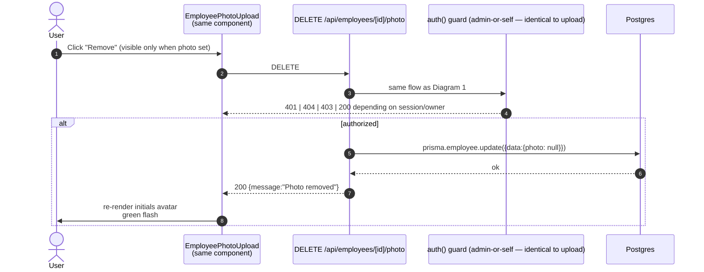

# Photo Upload Flow

Photos are stored inline in Postgres as base64 `data:image/...` URLs (the `Employee.photo` column is `String? @db.Text`). There is **no S3 / Cloudinary** dependency — keeps the stack small until size demands otherwise.

The 2 MB cap is enforced **twice**: once client-side for fast UX feedback, once server-side as the authoritative gate.

## Diagram 1 — Upload

```mermaid
sequenceDiagram
  autonumber
  actor User
  participant Widget as EmployeePhotoUpload<br/>(components/dashboard/employee-photo-upload.tsx)
  participant Reader as FileReader<br/>(browser)
  participant API as POST /api/employees/[id]/photo<br/>(app/api/employees/[id]/photo/route.ts)
  participant Auth as auth() guard
  participant Val as Server validators
  participant DB as Postgres

  User->>Widget: Click avatar (or "Upload" button)
  Widget->>Widget: open <input type="file" accept="image/*">
  User->>Widget: Pick file
  Widget->>Val: Client-side validation
  alt !file.type.startsWith("image/")
    Val-->>User: red ❌ "Please select an image file"
  else file.size > 2 * 1024 * 1024
    Val-->>User: red ❌ "Image must be less than 2MB"
  else valid
    Widget->>Reader: readAsDataURL(file)
    Reader-->>Widget: base64 dataURL (e.g. data:image/png;base64,…)
    Widget->>API: POST {photo: "<dataURL>"}
    API->>Auth: auth() ⇒ require session
    alt no session
      Auth-->>Widget: 401 "Unauthorized"
    else session present
      Auth->>DB: prisma.employee.findUnique({where:{id}})
      alt employee missing
        Auth-->>Widget: 404 "Employee not found"
      else employee present
        Auth->>Auth: isAdmin = role === "ADMIN"<br/>isOwn = userId === session.user.id
        alt !isAdmin && !isOwn
          Auth-->>Widget: 403 "Forbidden"
        else authorized
          API->>Val: photo.startsWith("data:image/")
          alt invalid prefix
            Val-->>Widget: 400 "Invalid image format"
          else valid prefix
              Val->>Val: byteSize = ceil(photo.length * 3 / 4)<br/>must be ≤ 2 MB
              alt over cap
                Val-->>Widget: 400 "Photo must be less than 2MB"
              else within cap
                API->>DB: prisma.employee.update({where:{id}, data:{photo}})
                DB-->>API: {id, photo}
                API-->>Widget: 200 {id, photo}
                Widget->>User: re-render <Image src=base64><br/>+ green "Photo updated successfully!" (auto-clears after 3s)
              end
            end
          end
        end
      end
    end
  end
```

### Authorization — `admin-or-self`

The server re-derives authorization from the **DB row** the route is acting on:

```ts
const isAdmin = session.user.role === "ADMIN";
const isOwnProfile = employee.userId === session.user.id;
if (!isAdmin && !isOwnProfile) return 403 Forbidden;
```

This holds even if the `[id]` URL parameter is tampered with — the server looks up `Employee.userId` itself.

### Why both client *and* server size checks?

- The client check prevents wasted bandwidth on a known-too-large image.
- The server check is the**authoritative** gate. A hand-crafted `POST` can bypass the browser entirely, so we recompute `ceil(photo.length * 3 / 4)` from the base64 payload.

> The factor `3/4` is a first-order approximation of base64 overhead (4 base64 chars per 3 raw bytes, ignoring padding). Tight enough for a hard cap.

### Why base64 in-DB?

- Single source of truth, zero infra.
- The ~33% size overhead is acceptable up to the 2 MB cap.
- Production: when real photos start clipping, swap to S3 / R2 and keep this route shape (single `photo: string` API).

---

## Diagram 2 — Delete



### File map

| File                                                    | Role                                          |
| ------------------------------------------------------- | --------------------------------------------- |
| `components/dashboard/employee-photo-upload.tsx`        | Avatar + file input + Remove button + toasts  |
| `app/api/employees/[id]/photo/route.ts`                | POST (upload) + DELETE (remove) handlers      |
| `prisma/schema.prisma`                                  | `Employee.photo String? @db.Text` column      |
| `app/dashboard/employees/[id]/page.tsx`                 | Mounts the widget with `initialPhoto` prop    |

### Edge case — `User.password` is nullable in the schema

`User.password` is `String?` in `prisma/schema.prisma`, so the schema allows null. In practice, almost every Employee↔User pair today has a populated password (Registration always hashes one; Quick Add mints `password123` for **new** Users).

**However**, Quick Add only mints a password when the User is *new*. If a User with the same email already exists — including one created by **GitHub OAuth**, where `password` is `null` — `app/api/employees/route.ts` reuses it and the password stays `null`. The result is an `Employee` whose `UserId` points at a password-less account. That case is narrow in practice but the schema makes it possible.

**Consequences:**
- Photo upload (this route) is unaffected — it doesn't read `password`.
- The change-password route returns `"This account has no password to update"` for those accounts, which is the documented behavior.
